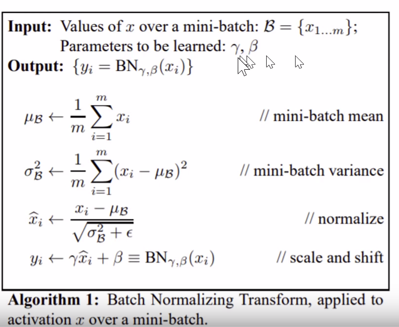
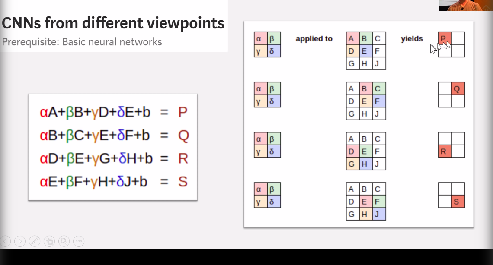
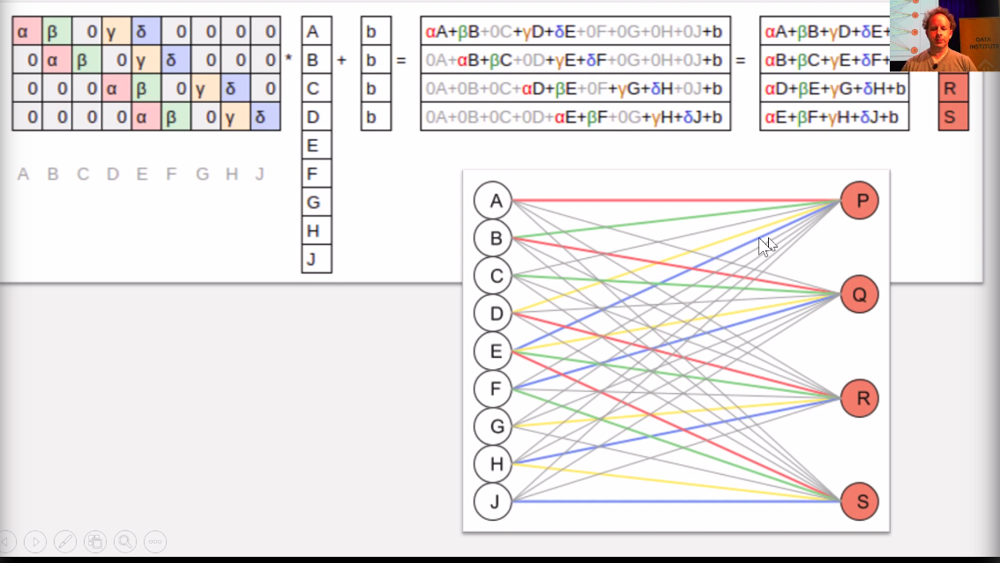

## Valuable Links 

1. Count and sort with Pandas https://stackoverflow.com/questions/40454030/count-and-sort-with-pandas
2. Using `isin` for selecting from a list https://stackoverflow.com/questions/40454030/count-and-sort-with-pandas


### Topics

1. Collaborative filtering with Fastai https://towardsdatascience.com/collaborative-filtering-with-fastai-3dbdd4ef4f00

## Valuable snippets

### Dropping duplicates
```python
dedup_df = without_reviews_df.drop_duplicates(
                                   subset=['product_id', 'user_nickname', 'review_text'], 
                                   keep='first', 
                                   inplace=False)
dedup_df
```

### Group by

```python
grouped_by_category_df = dedup_df.groupby(by='product_category_primary')
grouped_by_category_df
```

### Group by `user_nickname` in sorted order and `count` the number of products in each group and return `nlargest` groups

```python
x = (relevant_makeup_df.groupby(by=['user_nickname'], sort=True)['product']
                  .count()
                  .nlargest(38679))
```

### Find percentage of missing values in the dataset

1. `relevant_makeup_df.isna().sum()` Finds the all the `nan` or `null` values in the dataset for each column
    and sums it up
2.  `relevant_makeup_df.shape[0]` Fetches the number of rows in the dataset and divides the result of 1 and multiples by 100 to make it percentage
```python
relevant_makeup_df.isna().sum()/relevant_makeup_df.shape[0] * 100
```

### Find and assign all not null values to a dataframe for a specific column

```python
# For each group - in this case for user `Mochapj`
d = grouped_by_user_df.get_group('Mochapj')

# Find all the `skinConcerns` that are not null
skin_concerns_df = d[d['skinConcerns'].notnull()]

# Fetch the unique value if only one
skin_concerns_df['skinConcerns'].unique()[0]

# select all records from `relevant_make_df` for the user `Mochapj` and assign the attribute `skinConcerns` with the value `aging`
relevant_makeup_df.loc[relevant_makeup_df['user_nickname']=='Mochapj', 'skinConcerns'] = 'aging'

# List and view the updated values
relevant_makeup_df.loc[relevant_makeup_df['user_nickname']=='Mochapj']
```

### Drop `na` values for a specific column in a dataframe

```python
df.dropna(subset=['EPS'], how='all', inplace=True)
```

### What is weight decay

Weight decay penalises complexity by subtracting the square of the weights of the parameters and multiples it with a constant
This is so that the best loss is not substituting the values of the parameters with 0
Hence wd is usually `e-1` or `e-01`

### Standard SGD 

Here the following things happen

```python
y = ax + b
```

Where m is the slope and b is the intercept

1. Loss is calculated by the `mse` function which subtracts the `(y' - y) ** 2` and finds the `mean` of it
2. We assume the value of 
```python
def mse(y_hat, y): 
    return ((y_hat-y)**2).mean()

a = nn.Parameter(a); a

def update():
    y_hat = x@a
    loss = mse(y, y_hat)
    if t % 10 == 0: print(loss)
    loss.backward()
    with torch.no_grad():
        a.sub_(lr * a.grad)
        a.grad.zero_()
```

### SGD with weight decay

```python
def update(x,y,lr):
    wd = 1e-5
    y_hat = model(x)
    # weight decay
    w2 = 0.
    for p in model.parameters(): w2 += (p**2).sum()
    # add to regular loss
    loss = loss_func(y_hat, y) + w2*wd
    loss.backward()
    with torch.no_grad():
        for p in model.parameters():
            p.sub_(lr * p.grad)
            p.grad.zero_()
    return loss.item()
```

## What is momentum

Momentum is a constant that is used to multiply the derivative which `a.gradient` or `p.gradient`
in the earlier example in way where it adds momentum to the direction in which the model is learning

assuming b = 0.9 (beta/momentum)

1. So assuming for epoch 1 the gradient was 0.59 and epoch 2 the gradient was 0.74 the calculation for the new weight for a b would
multiply the 0.59 (previous epoch) with 0.9 thus retaining the old momentum and multiply gradient of epoch 2 with 0.1 and subtract the weights

Thus maintaining directional momentum. (momentum = 0.9 is the standard) 


## Loss functions

1. SGD which uses Mean squared error
2. Adam
3. RMSProp 

### RMSProp

RMSPRop is very similar to Adagrad, with the aim of resolving Adagrad’s primary limitation. Adagrad will continually shrink the learning rate for a given parameter (effectively stopping training on that parameter eventually). RMSProp however is able to shrink or increase the learning rate.

RMSProp will divide the overall learning rate by the square root of the sum of squares of the previous update gradients for a given parameter (as is done in Adagrad). The difference is that RMSProp doesn’t weight all of the previous update gradients equally, it uses an exponentially weighted moving average of the previous update gradients. This means that older values contribute less than newer values. This allows it to jump around the optimum without getting further and further away.

Further, it allows us to account for changes in the hypersurface as we travel down the gradient, and adjust learning rate accordingly. If our parameter is stuck in a shallow plain, we'd expect it's recent gradients to be small, and therefore RMSProp increases our learning rate to push through it. Likewise, when we quickly descend a steep valley, RMSProp lowers the learning rate to avoid popping out of the minima.

### Adam

Adam (Adaptive Moment Estimation) combines the benefits of momentum with the benefits of RMSProp. Momentum is looking at the moving average of the gradient, and continues to adjust a parameter in that direction. RMSProp looks at the weighted moving average of the square of the gradients; this is essentially the recent variance in the parameter, and RMSProp shrinks the learning rate proportionally. Adam does both of these things - it multiplies the learning rate by the momentum, but also divides by a factor related to the variance.


## What are dropoffs

Use regularisation rather than reducing than parameters. 

```python
last_learner = tabular_learner(data, layers=[1000,500], ps=[0.001,0.01], emb_drop=0.04, 
                        y_range=y_range, metrics=accuracy)
```

### p in tabular_learner
It's form of regularisation. p in `tabular_learners` is the probability of dropping
activations for each layer. It's specified on a per layer basis. `p=[0.001, 0.01]`

The common value is `0.5`. The layer activations are dropped off with the probability of p

Dropouts aren't used at the time of testing. Only during training. The library handles it.
 

### layers in tabular_learner
It's the number of attributes you want to assign for each feature (input parameter). It defines the shape of the parameter matrix that the input will be multiplied with
You can specify multiple layers for tabular data. `layers=[100, 50]`


### emb_drop in tabular_learner
Embedding dropoffs deletes the outputs of the activations of certain embeddings at random with some probability

 
 ## Predictions for tabular learner
 
 ```python
for index, row in test_df.iloc[0:50].iterrows():
    actual = row['rating']
    prediction = last_learner.predict(row)
    prediction_ratios = prediction[2].numpy()
    scores = [(c, k) for c, k in zip(last_learner.data.train_dl.classes, prediction_ratios)]
    top_scores = sorted(scores, key=lambda x: x[1], reverse=True)[:2]
    first_score = top_scores[0][1]
    second_score = top_scores[1][1]
    
    if first_score > 0.65:
        print(f'Sure - a: {actual} p: {prediction[0]} r: {prediction_ratios}')
    else:
        print(f'Unsure a: {actual} p*: {top_scores[0][0], top_scores[1][0]} r: {scores}')

```

## What is BatchNormalisation

It reduces something called Internal Covariant Shift. Math has proved that it doesn't reduce internal covariant shift and why it works is not because of internal covariant shift



1. For each mini batch `x` which is activations, first we find the mean
2. Find the variance of all the activations
3. We normalize the value that is `(values - mean / standard deviation)`
4. Scale and shift where we add a bias term and another variable like a bias term which is multipled instead of adding. Hence `scaled`

## Convolution2D 

Convolution2D essentially scans the pixels of an image as a 2x2 (as defined) matrix and multiples the values of each pixel with a weight and reduces a 2x2
matrix of pixels into a single value.



In the above image the weights for alpha, beta, gamma and theta represent the weights identifying certain colors and reducing the result to a 2x2 matrix



This image represents how the image matrix having
```python
[   
    [a, b, c], 
    [d, e, f], 
    [h, i, j]
]

```

is now flattened into a 1 dimensonal tensor `[a, b, c, d, e, f, g, h, i, j]`

The `b` in the example represents the bias. 


